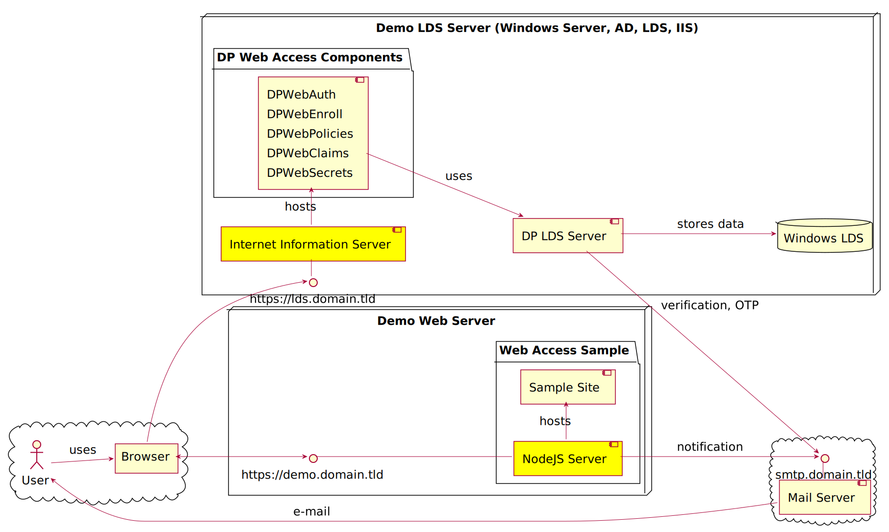

  

# Prerequisites

## Software

This sample requires the following products to be installed and configured:

* Windows ADAM Service (LDS)
* DigitalPersona LDS Server (DP LDS Server)
* DigitalPersona LDS Administration Tools (DP LDS AT)
* DigitalPersona LDS Web Management Components (DP LDS WMC)

Recommended deployment infrastructure diagram:

<small>NOTE: this diagram is created using [PlantUML](http://plantuml.com/index). Do not edit the SVG file directly.
Use the [PlantUML](https://marketplace.visualstudio.com/items?itemName=jebbs.plantuml) VS Code extension or [PlantUML Online Server](http://www.plantuml.com/plantuml/uml) to edit and preview pUML files and export them to SVG.</small>

## LDS Web Management Components

DP LDS WMC services must be accessible from the Internet using DNS and must use HTTPS with a certificate signed by a public certification authority (CA).
Self-signed certificates won't be accepted (running in development mode is an exception).

## DigitalPersona LDS Server

DP LDS Server comes with an evaluation license allowing enrollment of up to 10 users
during first 30 days. If you need more users or a longer enrollment period, you can obtain and apply a DigitalPersona Server license.

## Additional prerequisites

To use Face credentials, an Innovatrics Face Engine license must be obtained and applied.

To use SMS OTP, a Nexmo SMS gateway account must be obtained and configured.

To use Push Notifications OTP, a Push Notification API key and Tenant ID must be obtained and configured.

To use Email verification and OTP sending, a SMTP server must be configured.

---
Next: [Build the server](./build)
